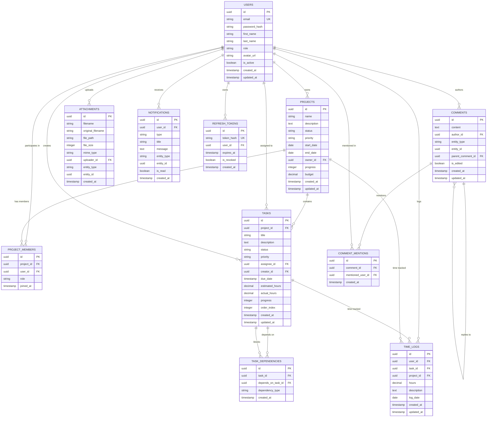

# Database Schema Design

## PostgreSQL Schema Overview

The Project Management Dashboard uses a normalized PostgreSQL database with the following core entities:
- Users and Roles (Authentication)
- Projects and Project Members (Project Management)
- Tasks and Task Dependencies (Task Management)
- Comments and Mentions (Collaboration)
- Time Logs (Time Tracking)
- Attachments (File Management)
- Notifications (Communication)

## Table Definitions

### Users Table
```sql
CREATE TABLE users (
    id UUID PRIMARY KEY DEFAULT gen_random_uuid(),
    email VARCHAR(255) UNIQUE NOT NULL,
    password_hash VARCHAR(255) NOT NULL,
    first_name VARCHAR(100) NOT NULL,
    last_name VARCHAR(100) NOT NULL,
    role VARCHAR(50) NOT NULL DEFAULT 'team_member' 
        CHECK (role IN ('admin', 'project_manager', 'team_member', 'viewer')),
    avatar_url VARCHAR(500),
    is_active BOOLEAN DEFAULT TRUE,
    created_at TIMESTAMP WITH TIME ZONE DEFAULT CURRENT_TIMESTAMP,
    updated_at TIMESTAMP WITH TIME ZONE DEFAULT CURRENT_TIMESTAMP
);

-- Indexes
CREATE INDEX idx_users_email ON users(email);
CREATE INDEX idx_users_role ON users(role);
CREATE INDEX idx_users_active ON users(is_active);
```

### Projects Table
```sql
CREATE TABLE projects (
    id UUID PRIMARY KEY DEFAULT gen_random_uuid(),
    name VARCHAR(255) NOT NULL,
    description TEXT,
    status VARCHAR(50) NOT NULL DEFAULT 'planning'
        CHECK (status IN ('planning', 'active', 'on_hold', 'completed', 'cancelled')),
    priority VARCHAR(50) NOT NULL DEFAULT 'medium'
        CHECK (priority IN ('low', 'medium', 'high', 'critical')),
    start_date DATE,
    end_date DATE,
    owner_id UUID NOT NULL REFERENCES users(id) ON DELETE CASCADE,
    progress INTEGER DEFAULT 0 CHECK (progress >= 0 AND progress <= 100),
    budget DECIMAL(12,2),
    created_at TIMESTAMP WITH TIME ZONE DEFAULT CURRENT_TIMESTAMP,
    updated_at TIMESTAMP WITH TIME ZONE DEFAULT CURRENT_TIMESTAMP,
    
    CONSTRAINT valid_date_range CHECK (end_date IS NULL OR start_date IS NULL OR end_date >= start_date)
);

-- Indexes
CREATE INDEX idx_projects_owner ON projects(owner_id);
CREATE INDEX idx_projects_status ON projects(status);
CREATE INDEX idx_projects_priority ON projects(priority);
CREATE INDEX idx_projects_dates ON projects(start_date, end_date);
```

### Project Members Table (Many-to-Many)
```sql
CREATE TABLE project_members (
    id UUID PRIMARY KEY DEFAULT gen_random_uuid(),
    project_id UUID NOT NULL REFERENCES projects(id) ON DELETE CASCADE,
    user_id UUID NOT NULL REFERENCES users(id) ON DELETE CASCADE,
    role VARCHAR(50) DEFAULT 'member'
        CHECK (role IN ('owner', 'manager', 'member', 'viewer')),
    joined_at TIMESTAMP WITH TIME ZONE DEFAULT CURRENT_TIMESTAMP,
    
    UNIQUE(project_id, user_id)
);

-- Indexes
CREATE INDEX idx_project_members_project ON project_members(project_id);
CREATE INDEX idx_project_members_user ON project_members(user_id);
```

### Tasks Table
```sql
CREATE TABLE tasks (
    id UUID PRIMARY KEY DEFAULT gen_random_uuid(),
    project_id UUID NOT NULL REFERENCES projects(id) ON DELETE CASCADE,
    title VARCHAR(255) NOT NULL,
    description TEXT,
    status VARCHAR(50) NOT NULL DEFAULT 'todo'
        CHECK (status IN ('todo', 'in_progress', 'review', 'done')),
    priority VARCHAR(50) NOT NULL DEFAULT 'medium'
        CHECK (priority IN ('low', 'medium', 'high', 'critical')),
    assignee_id UUID REFERENCES users(id) ON DELETE SET NULL,
    creator_id UUID NOT NULL REFERENCES users(id) ON DELETE CASCADE,
    due_date TIMESTAMP WITH TIME ZONE,
    estimated_hours DECIMAL(5,2) CHECK (estimated_hours > 0),
    actual_hours DECIMAL(5,2) DEFAULT 0 CHECK (actual_hours >= 0),
    progress INTEGER DEFAULT 0 CHECK (progress >= 0 AND progress <= 100),
    order_index INTEGER DEFAULT 0,
    created_at TIMESTAMP WITH TIME ZONE DEFAULT CURRENT_TIMESTAMP,
    updated_at TIMESTAMP WITH TIME ZONE DEFAULT CURRENT_TIMESTAMP
);

-- Indexes
CREATE INDEX idx_tasks_project ON tasks(project_id);
CREATE INDEX idx_tasks_assignee ON tasks(assignee_id);
CREATE INDEX idx_tasks_creator ON tasks(creator_id);
CREATE INDEX idx_tasks_status ON tasks(status);
CREATE INDEX idx_tasks_priority ON tasks(priority);
CREATE INDEX idx_tasks_due_date ON tasks(due_date);
```

### Task Dependencies Table
```sql
CREATE TABLE task_dependencies (
    id UUID PRIMARY KEY DEFAULT gen_random_uuid(),
    task_id UUID NOT NULL REFERENCES tasks(id) ON DELETE CASCADE,
    depends_on_task_id UUID NOT NULL REFERENCES tasks(id) ON DELETE CASCADE,
    dependency_type VARCHAR(50) DEFAULT 'finish_to_start'
        CHECK (dependency_type IN ('finish_to_start', 'start_to_start', 'finish_to_finish', 'start_to_finish')),
    created_at TIMESTAMP WITH TIME ZONE DEFAULT CURRENT_TIMESTAMP,
    
    UNIQUE(task_id, depends_on_task_id),
    CHECK (task_id != depends_on_task_id)
);

-- Indexes
CREATE INDEX idx_task_dependencies_task ON task_dependencies(task_id);
CREATE INDEX idx_task_dependencies_depends ON task_dependencies(depends_on_task_id);
```

### Comments Table
```sql
CREATE TABLE comments (
    id UUID PRIMARY KEY DEFAULT gen_random_uuid(),
    content TEXT NOT NULL,
    author_id UUID NOT NULL REFERENCES users(id) ON DELETE CASCADE,
    entity_type VARCHAR(50) NOT NULL CHECK (entity_type IN ('project', 'task')),
    entity_id UUID NOT NULL,
    parent_comment_id UUID REFERENCES comments(id) ON DELETE CASCADE,
    is_edited BOOLEAN DEFAULT FALSE,
    created_at TIMESTAMP WITH TIME ZONE DEFAULT CURRENT_TIMESTAMP,
    updated_at TIMESTAMP WITH TIME ZONE DEFAULT CURRENT_TIMESTAMP
);

-- Indexes
CREATE INDEX idx_comments_entity ON comments(entity_type, entity_id);
CREATE INDEX idx_comments_author ON comments(author_id);
CREATE INDEX idx_comments_parent ON comments(parent_comment_id);
CREATE INDEX idx_comments_created ON comments(created_at);
```

### Comment Mentions Table
```sql
CREATE TABLE comment_mentions (
    id UUID PRIMARY KEY DEFAULT gen_random_uuid(),
    comment_id UUID NOT NULL REFERENCES comments(id) ON DELETE CASCADE,
    mentioned_user_id UUID NOT NULL REFERENCES users(id) ON DELETE CASCADE,
    created_at TIMESTAMP WITH TIME ZONE DEFAULT CURRENT_TIMESTAMP,
    
    UNIQUE(comment_id, mentioned_user_id)
);

-- Indexes
CREATE INDEX idx_comment_mentions_comment ON comment_mentions(comment_id);
CREATE INDEX idx_comment_mentions_user ON comment_mentions(mentioned_user_id);
```

### Time Logs Table
```sql
CREATE TABLE time_logs (
    id UUID PRIMARY KEY DEFAULT gen_random_uuid(),
    user_id UUID NOT NULL REFERENCES users(id) ON DELETE CASCADE,
    task_id UUID NOT NULL REFERENCES tasks(id) ON DELETE CASCADE,
    project_id UUID NOT NULL REFERENCES projects(id) ON DELETE CASCADE,
    hours DECIMAL(5,2) NOT NULL CHECK (hours > 0),
    description TEXT,
    log_date DATE NOT NULL,
    created_at TIMESTAMP WITH TIME ZONE DEFAULT CURRENT_TIMESTAMP,
    updated_at TIMESTAMP WITH TIME ZONE DEFAULT CURRENT_TIMESTAMP
);

-- Indexes
CREATE INDEX idx_time_logs_user ON time_logs(user_id);
CREATE INDEX idx_time_logs_task ON time_logs(task_id);
CREATE INDEX idx_time_logs_project ON time_logs(project_id);
CREATE INDEX idx_time_logs_date ON time_logs(log_date);
CREATE INDEX idx_time_logs_user_date ON time_logs(user_id, log_date);
```

### Attachments Table
```sql
CREATE TABLE attachments (
    id UUID PRIMARY KEY DEFAULT gen_random_uuid(),
    filename VARCHAR(255) NOT NULL,
    original_filename VARCHAR(255) NOT NULL,
    file_path VARCHAR(500) NOT NULL,
    file_size INTEGER NOT NULL CHECK (file_size > 0),
    mime_type VARCHAR(100) NOT NULL,
    uploader_id UUID NOT NULL REFERENCES users(id) ON DELETE CASCADE,
    entity_type VARCHAR(50) NOT NULL CHECK (entity_type IN ('project', 'task', 'comment')),
    entity_id UUID NOT NULL,
    created_at TIMESTAMP WITH TIME ZONE DEFAULT CURRENT_TIMESTAMP
);

-- Indexes
CREATE INDEX idx_attachments_entity ON attachments(entity_type, entity_id);
CREATE INDEX idx_attachments_uploader ON attachments(uploader_id);
CREATE INDEX idx_attachments_created ON attachments(created_at);
```

### Notifications Table
```sql
CREATE TABLE notifications (
    id UUID PRIMARY KEY DEFAULT gen_random_uuid(),
    user_id UUID NOT NULL REFERENCES users(id) ON DELETE CASCADE,
    type VARCHAR(50) NOT NULL CHECK (type IN ('mention', 'task_assigned', 'comment', 'project_update', 'deadline_reminder')),
    title VARCHAR(255) NOT NULL,
    message TEXT NOT NULL,
    entity_type VARCHAR(50) CHECK (entity_type IN ('project', 'task', 'comment')),
    entity_id UUID,
    is_read BOOLEAN DEFAULT FALSE,
    created_at TIMESTAMP WITH TIME ZONE DEFAULT CURRENT_TIMESTAMP
);

-- Indexes
CREATE INDEX idx_notifications_user ON notifications(user_id);
CREATE INDEX idx_notifications_read ON notifications(is_read);
CREATE INDEX idx_notifications_type ON notifications(type);
CREATE INDEX idx_notifications_created ON notifications(created_at);
```

### Refresh Tokens Table
```sql
CREATE TABLE refresh_tokens (
    id UUID PRIMARY KEY DEFAULT gen_random_uuid(),
    token_hash VARCHAR(255) NOT NULL UNIQUE,
    user_id UUID NOT NULL REFERENCES users(id) ON DELETE CASCADE,
    expires_at TIMESTAMP WITH TIME ZONE NOT NULL,
    is_revoked BOOLEAN DEFAULT FALSE,
    created_at TIMESTAMP WITH TIME ZONE DEFAULT CURRENT_TIMESTAMP
);

-- Indexes
CREATE INDEX idx_refresh_tokens_user ON refresh_tokens(user_id);
CREATE INDEX idx_refresh_tokens_expires ON refresh_tokens(expires_at);
CREATE INDEX idx_refresh_tokens_hash ON refresh_tokens(token_hash);
```

## Entity Relationships

### Primary Relationships

1. **Users → Projects** (One-to-Many via owner_id)
   - A user can own multiple projects
   - A project has one owner

2. **Users ↔ Projects** (Many-to-Many via project_members)
   - A user can be a member of multiple projects
   - A project can have multiple members

3. **Projects → Tasks** (One-to-Many)
   - A project can have multiple tasks
   - A task belongs to one project

4. **Users → Tasks** (One-to-Many via assignee_id)
   - A user can be assigned to multiple tasks
   - A task can have one assignee

5. **Tasks ↔ Tasks** (Many-to-Many via task_dependencies)
   - A task can depend on multiple other tasks
   - A task can block multiple other tasks

6. **Users → Comments** (One-to-Many)
   - A user can author multiple comments
   - A comment has one author

7. **Comments → Comments** (One-to-Many via parent_comment_id)
   - A comment can have multiple replies
   - A reply belongs to one parent comment

8. **Users → Time Logs** (One-to-Many)
   - A user can have multiple time log entries
   - A time log belongs to one user

9. **Tasks → Time Logs** (One-to-Many)
   - A task can have multiple time log entries
   - A time log belongs to one task

10. **Users → Attachments** (One-to-Many via uploader_id)
    - A user can upload multiple attachments
    - An attachment has one uploader

## Entity-Relationship Diagram

Here's the ER diagram showing the relationships between tables:



## Database Constraints and Business Rules

### Data Integrity Constraints

1. **Email Uniqueness**: User emails must be unique across the system
2. **Role Validation**: User roles limited to predefined values
3. **Date Validation**: Project end dates must be after start dates
4. **Progress Validation**: Progress percentages must be between 0-100
5. **Time Validation**: Time log hours must be positive values
6. **File Size Validation**: Attachment file sizes must be positive
7. **Circular Dependencies**: Task dependencies cannot create circular references

### Business Logic Constraints

1. **Project Ownership**: Project owners are automatically project members
2. **Task Assignment**: Tasks can only be assigned to project members
3. **Comment Context**: Comments must reference valid projects or tasks
4. **Time Tracking**: Time can only be logged against active tasks
5. **Notification Recipients**: Notifications sent only to project members
6. **File Access**: Attachments accessible only to project members

### Performance Considerations

1. **Indexing Strategy**: Comprehensive indexes on frequently queried columns
2. **Foreign Key Indexes**: All foreign keys have corresponding indexes
3. **Composite Indexes**: Multi-column indexes for complex queries
4. **Partial Indexes**: Conditional indexes for specific use cases
5. **Query Optimization**: Normalized structure optimized for read operations

### Data Archival Strategy

1. **Soft Deletes**: Important entities use soft delete pattern
2. **Audit Trail**: Created/updated timestamps on all entities
3. **Historical Data**: Maintain history for reporting and compliance
4. **Cleanup Procedures**: Automated cleanup of expired tokens and notifications

## Database Initialization Scripts

The database will be initialized using migration scripts that:
1. Create all tables with proper constraints
2. Set up indexes for optimal performance
3. Insert default data (admin user, sample roles)
4. Configure database-level security settings
5. Set up backup and maintenance procedures 